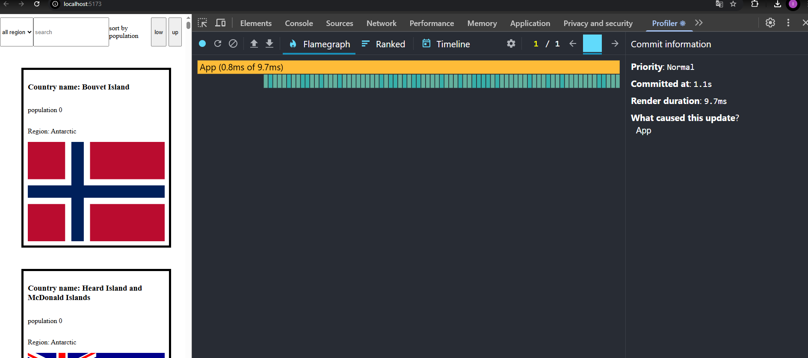
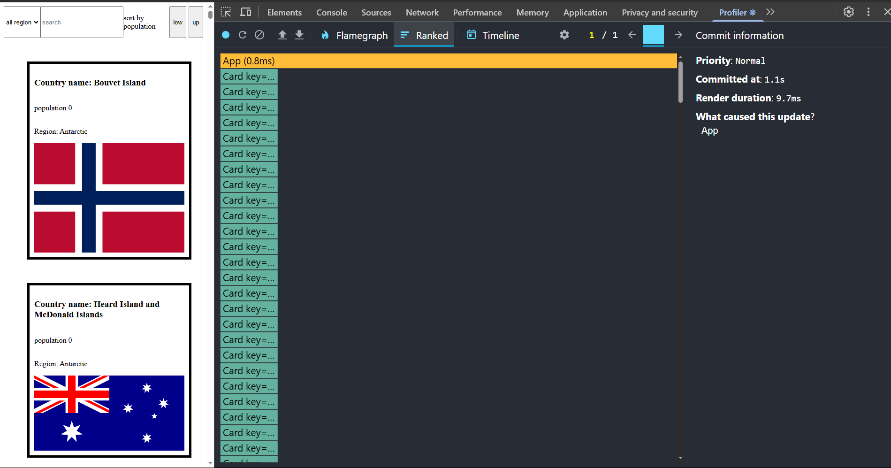

**not using react memo**

Commit Duration: 1.1s  
Render Duration: 9.7ms 
Interactions: using sort low  
Flame Graph: 

Ranked Char: 

**using react memo**

Commit Duration: 0.7s (after optimization it takes less time)  
Render Duration: 1.7ms ( after optimization, it takes much less time to render a page  ) 
Interactions: using sort low  
Flame Graph: 

Ranked Char: 
